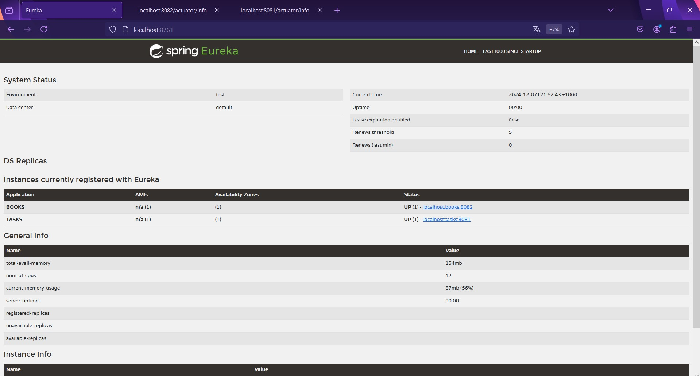
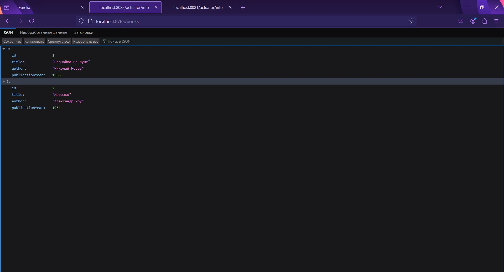
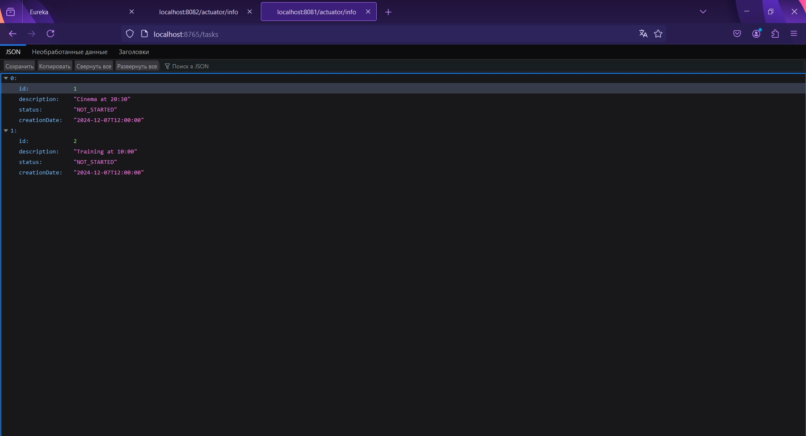
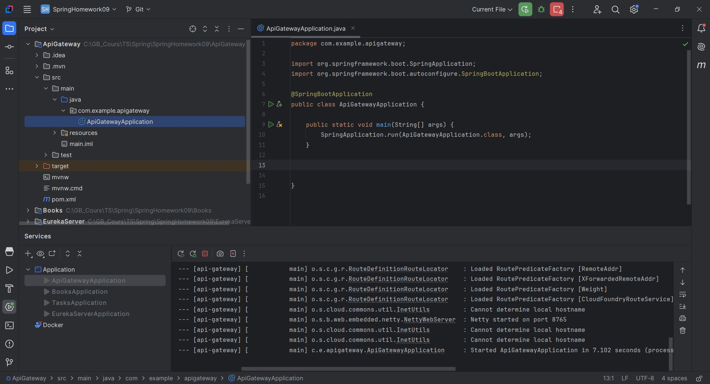

# Урок 9. 
Spring Cloud. Микросервисная архитектура.

Задание: 
Создайте простую микросервисную архитектуру с использованием Spring Cloud. 
Ваша архитектура должна включать хотя бы два микросервиса и службу распределения.

=====================================================================================

## Демонстрация решения:

